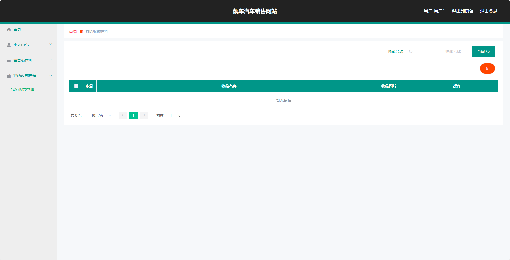
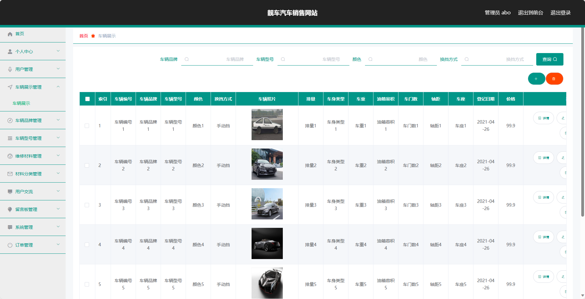

## 基于SpringBoot靓车汽车销售网站(程序+报告)

###  获取sql数据库文件: 从戎源码网 (https://armycodes.com/) QQ: 386869957 QQ群: 377586148
###  所有系统地址: (https://github.com/YuLin-Coder/AllProjectCatalog) 
###  所有项目以及源代码本人均调试运行无问题 可支持远程安装部署调试、定制修改、代码讲解

## 项目介绍
基于SpringBoot靓车汽车销售网站，系统包含两种角色：管理员、用户,系统分为前台和后台两大模块，主要功能如下。

### 【管理员】:
- 个人中心：管理员可以管理个人信息和修改密码等。
- 用户管理：管理员可以对用户进行管理，
- 车辆展示管理：管理员可以管理车辆的展示信息，
- 车辆品牌管理：管理员可以管理车辆品牌的信息，
- 车辆型号管理：管理员可以管理车辆型号的信息，
- 维修材料管理：管理员可以管理维修材料的信息，
- 材料分类管理：管理员可以管理材料的分类信息，
- 用户交流留言板管理：管理员可以管理用户之间交流的留言板，。
- 系统管理：管理员可以管理系统的基本设置，
- 订单管理：管理员可以管理用户的订单信息，

### 【前台】:
- 首页：展示网站的概要信息和推荐车辆。
- 车辆展示：展示可供销售的汽车。
- 用户交流：提供用户之间的交流平台。
- 汽车资讯：提供关于汽车行业的最新资讯和相关文章。
- 留言反馈：用户可以留下对于网站或车辆的反馈和建议。
- 个人中心：用户可以管理个人信息、查看订单状态以及管理个人收藏。
- 购物车：用户可以将感兴趣的车辆加入购物车并进行管理。
- 在线客服：提供在线客服支持。

### 【用户】:
- 个人中心：用户可以管理个人信息和修改密码等。
- 留言板管理：管理员可以管理用户留言的审核和回复。
- 我的收藏管理：用户可以查看和管理自己收藏的车辆信息。

## 项目技术
- 编程语言：Java
- 数据库：MySQL
- 项目管理工具：Maven
- 前端技术：HTML、CSS、JavaScript、Jquery、Vue
- 后端技术：Spring、SpringMVC、MyBatis

## 运行环境
- JDK版本：JDK1.8及以上
- 开发工具：IDEA、Ecplise、Myecplise都可以
- 数据库: MySQL5.7及以上
- Maven：maven3.0及以上
- Node：14.14.0及以上

## 运行截图

